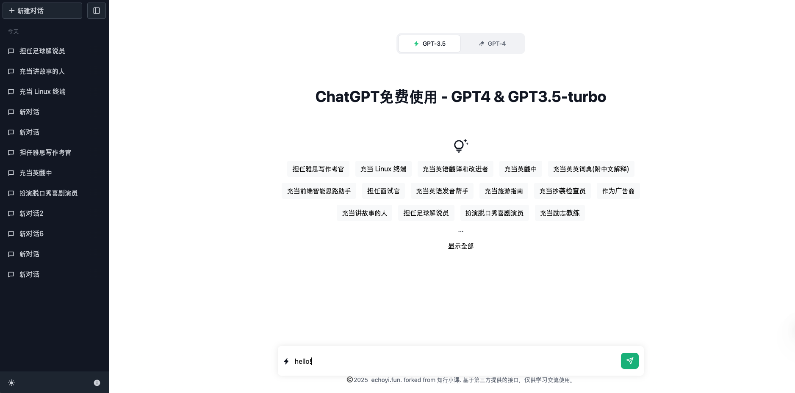

## ChatGPT App frontend by React & Next.js

A ChatGPT-like chat interface built with modern web technologies. This project was developed following the amazing React practical tutorial made by [知行小课](https://github.com/zhixingxiaoke/react-hands-on-tutorial-for-beginners).

### 📃 Preview(🚧 under building)



### 🚀 Tech Stack

- **React** - A JavaScript library for building user interfaces
- **Next.js** - The React Framework for Production
- **Tailwind CSS** - A utility-first CSS framework
- **React icons** - A library of icons for React

### ✨ Features

- Clean and intuitive chat interface
- Real-time message updates
- Responsive design for awesome UI/UX
- Interaction with current advanced LLM chatbots (such as GPT4 and DeepSeek v3)

### 🎯 Purpose

This project serves as a hands-on learning experience to:

- Practice React and Next.js development
- Master Tailwind CSS styling
- Understand modern frontend architecture
- Implement real-world chat functionality

### 🛠️ Getting Started

1. Clone the repository

```bash
git clone https://github.com/echoyidotfun/chatgpt-app-by-react.git
```

2. Install dependencies

```bash
npm install
```

3. Start the development server

```bash
npm run dev
```

4. Open [http://localhost:3000](http://localhost:3000) with your browser to see the result.

### 📝 Notes

This is a learning project created as part of React practical tutorial build by [知行小课](https://github.com/zhixingxiaoke/react-hands-on-tutorial-for-beginners). It is intended for educational purposes and practice. I highly recommend going to [Bilibili](https://www.bilibili.com/video/BV1ZF411r7Zq) to watch their courses for more detailed and in-depth learning.
